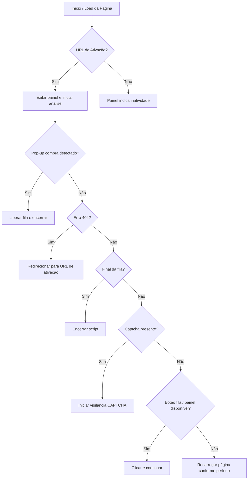

# SISRU Automação - Almoço (v39.2)

Automação para o **SISRU** voltada à reserva de **almoço**, com lógica específica para aceleração em horários de pico, tratamento de CAPTCHA e monitoramento do estado do script.

---

## Índice

1. [Informações Gerais](#informações-gerais)
2. [Blindagem de Pré-Execução](#blindagem-de-pré-execução)
3. [Configurações](#configurações)
4. [Estado da Aplicação](#estado-da-aplicação)
5. [Utilitários Globais](#utilitários-globais)
6. [Módulo de CAPTCHA](#módulo-de-captcha)
7. [Lógica de Negócio e Estados](#lógica-de-negócio-e-estados)
8. [Inicialização](#inicialização)

---

## Informações Gerais

* **Autor:** Natan Willian Noronha (com modificações)
* **Versão:** 39.2
* **Namespace:** `http://tampermonkey.net/`
* **URL de Ativação:** `https://app.unesp.br/sisru-franca/cliente/selecionarFilaPorPeriodoDeAtendimento.do`
* **Refeição Alvo:** Almoço
* **Licença:** MIT
* **Execução:** `document-idle`
* **Compatibilidade:** Navegadores com suporte a Tampermonkey/GreaseMonkey
* **URLs de atualização e suporte:**

  * [Update](https://raw.githubusercontent.com/seu-usuario/repositorio/main/sisru-almoco.user.js)
  * [Download](https://raw.githubusercontent.com/seu-usuario/repositorio/main/sisru-almoco.user.js)
  * [Issues](https://github.com/seu-usuario/repositorio/issues)
  * [Homepage](https://github.com/seu-usuario/repositorio)

---

## Blindagem de Pré-Execução

Antes da execução principal, o script verifica se o **jQuery** está carregado e se a função `highlight` existe, criando uma versão fantasma se necessário:

```js
if (typeof window.jQuery !== 'undefined' && !window.jQuery.fn.highlight) {
    window.jQuery.fn.highlight = function () { return this; };
}
```

* **Objetivo:** Evitar erros caso funções dependentes do jQuery não existam.

---

## Configurações

O objeto `CONFIG` centraliza todas as variáveis de configuração:

### Parâmetros principais

| Parâmetro            | Descrição                                 |
| -------------------- | ----------------------------------------- |
| `MODO_DEBUG`         | Ativa logs detalhados no console          |
| `URL_ATIVACAO`       | URL de ativação do script/fila do SISRU   |
| `TIPO_REFEICAO_ALVO` | Define a refeição alvo ("Almoço")         |
| `NOME_SCRIPT`        | Nome do script para logs                  |
| `ID_PAINEL`          | ID do painel de mensagens exibido na tela |

### Seletores do DOM

| Elemento                      | Selector CSS                                           |
| ----------------------------- | ------------------------------------------------------ |
| Iframe Cloudflare             | `"iframe[src*='challenges.cloudflare.com/turnstile']"` |
| Ícone de sucesso CAPTCHA      | `#success-i`                                           |
| Botão selecionar fila         | `#form\:j_idt24`                                       |
| Painel de seleção de refeição | `div.panelPeriodo h1`                                  |
| Pop-up compra feita           | `.ui-growl-item .ui-growl-title`                       |
| Botão liberar fila            | `#form\:j_idt67`                                       |

### Frases-chave para detecção

* Erro 404: `"página não encontrada"`
* Compra realizada: `"você já adquiriu todas as opções possíveis"`
* Fim de compra: `["aquisição de refeições", "sua posição na fila"]`
* CAPTCHA: `["verify you are human", "verificar se é humano", "realize a validação do captcha"]`
* Sem refeições: `"não há refeições disponíveis!"`

### Timers (em milissegundos)

| Evento                           | Intervalo |
| -------------------------------- | --------- |
| Reload normal                    | 2000      |
| Reload rápido                    | 1500      |
| Watchdog                         | 90000     |
| Timeout CAPTCHA                  | 120000    |
| Intervalo de verificação CAPTCHA | 500       |
| Delay carga da página            | 500       |

---

## Estado da Aplicação

Objeto `STATE` controla o estado global:

```js
const STATE = {
    watchdogTimer: null,
    isScriptActive: true,
};
```

* **watchdogTimer:** Timer de monitoramento do script.
* **isScriptActive:** Flag para ativar/desativar a execução.

---

## Utilitários Globais (`Utils`)

Funções auxiliares:

* `log(message)`: Loga mensagens no console se `MODO_DEBUG` estiver ativo.
* `mostrarMensagem(estado, msg, cor)`: Cria um painel fixo na tela para exibir mensagens.
* `isElementTrulyVisible(element)`: Verifica se um elemento está visível (display, opacity, tamanho).

---

## Módulo de CAPTCHA (`CaptchaHandler`)

Gerencia a validação de CAPTCHA Cloudflare:

* `iniciar()`: Exibe mensagem de espera e inicia vigilância.
* `vigiarResultado(startTime)`: Monitora a validação do CAPTCHA. Se for validado, chama `Logic.analisarEAgir()`.
* Timeout padrão: 2 minutos (`CAPTCHA_TIMEOUT`).
* Intervalo de checagem: 500ms.

---

## Lógica de Negócio e Estados (`Logic`)

### Períodos

Define horários de pico para aceleração:

```js
if ((d === 1 || d === 2) && h === 17) { tipo: 'PICO', descricao: 'Reserva antecipada (Seg/Ter 17h)' }
```

Outros picos (mesmo dia):

* 9h43-9h47 → Abertura 9h45
* 10h58-11h02 → Abertura 11h
* 12h43-12h59 → Xepa 12h43

### Ações principais (`analisarEAgir`)

1. Checa se pop-up de compra foi exibido; se sim, libera a fila.
2. Detecta erro 404 e retorna para a página de ativação.
3. Identifica final de compra (`STATUS_FIM_COMPRA`) e encerra script.
4. Verifica CAPTCHA e inicia módulo de vigilância.
5. Clica automaticamente em botões de seleção de fila e painel de refeição.
6. Recarrega a página se necessário, usando timers rápidos ou normais dependendo do período.

---

## Inicialização (`Main`)

* Evento `window.load` dispara `Main.init()`:

```js
if (window.location.href.startsWith(CONFIG.URL_ATIVACAO.split('?')[0])) {
    Utils.mostrarMensagem("INICIALIZANDO", `Script ${CONFIG.TIPO_REFEICAO_ALVO} v39.2 INICIADO!`, "#00bfff");
    setTimeout(Logic.analisarEAgir, CONFIG.TIMERS_MS.CARGA_PAGINA_DELAY);
} else {
    Utils.mostrarMensagem("INATIVO", "Automação pausada nesta página.", "#747d8c");
}
```

* Valida se a URL é compatível com a automação.
* Delay curto para permitir carregamento da página.

---

## Fluxo Geral do Script



